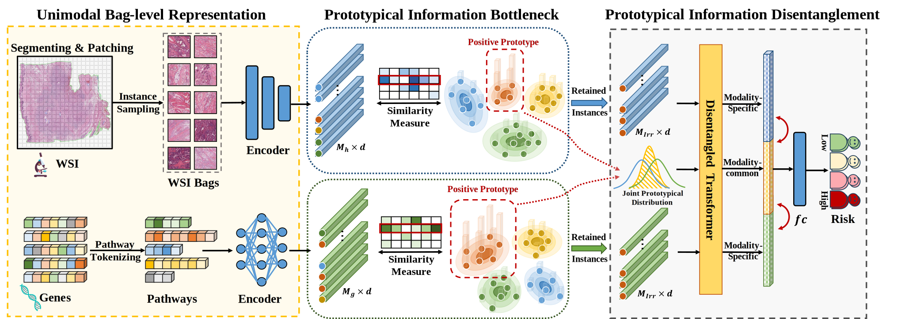

<div align="center">

<h1><a href="https://openreview.net/forum?id=otHZ8JAIgh">Prototypical Information Bottlenecking and Disentangling for Multimodal Cancer Survival Prediction</a></h1>

**[Yilan Zhang](https://scholar.google.com.hk/citations?user=wZ4M4ecAAAAJ&hl=en&oi=ao), [Yingxue Xu](https://scholar.google.com/citations?user=XY6NCLMAAAAJ&hl=en),
[Jianqi Chen](https://windvchen.github.io/), [Fengying Xie](https://scholar.google.com/citations?user=cxgMpCwAAAAJ&hl=en),
and [Hao Chen](https://scholar.google.com/citations?hl=en&user=Z_t5DjwAAAAJ)** 


[](#License)
[](https://arxiv.org/abs/2401.01646)

</div>

### Share us a :star: if this repo does help

This repository is the official implementation of *PIBD*. If you encounter any question, please feel free to contact us. 
You can create an issue or just send email to me (zhangyilan@buaa.edu.com). Also welcome for any idea exchange and discussion.

## Updates

[**05/05/2024**] The code is released.

[**01/05/2024**] Code cleanup done. Waiting to be made public.

## Table of Contents
- [Introduction](#introduction)
- [Data preparation](#data-preparation)
- [Requirements](#requirements)
- [Training & Testing](#training--testing)
- [Acknowledgement](#acknowledgement)
- [License & Citation](#license--citation)

## Introduction



Multimodal learning significantly benefits cancer survival prediction, especially
the integration of pathological images and genomic data. Despite advantages of
multimodal learning for cancer survival prediction, massive redundancy in multimodal data prevents it from extracting discriminative and compact information:
(1) An extensive amount of intra-modal task-unrelated information blurs discriminability, especially for gigapixel whole slide images (WSIs) with many patches
in pathology and thousands of pathways in genomic data, leading to an “intramodal redundancy” issue. 
(2) Duplicated information among modalities dominates the representation of multimodal data, which makes modality-specific information prone to being ignored, resulting in an “inter-modal redundancy” issue. 
To address these, we propose a new framework, Prototypical Information Bottlenecking and Disentangling (PIBD), consisting of Prototypical Information
Bottleneck (PIB) module for intra-modal redundancy and Prototypical Information Disentanglement (PID) module for inter-modal redundancy. Specifically, a
variant of information bottleneck, PIB, is proposed to model prototypes approximating a bunch of instances for different risk levels, which can be used for selection of discriminative instances within modality. 
PID module decouples entangled multimodal data into compact distinct components: modality-common and modality-specific knowledge, under the guidance of the joint prototypical distribution. 
Extensive experiments on five cancer benchmark datasets demonstrated our superiority over other methods. 

**Slides can be found [here](./imgs/PIBD_ICLT_Slides.pdf).**

## Data preparation
### WSIs
1. Preprocessing WSI data by [CLAM](https://github.com/mahmoodlab/CLAM). CLAM provides an easy-to-use tool for WSI preprocessing.
It is highly recommended to refer to [Tutorial-Precessing WSIs for MIL from Scratch](https://github.com/liupei101/Pipeline-Processing-TCGA-Slides-for-MIL) for more detials.
The tutorial provides a step-by-step guide form downloading TCGA slides to extracting patches and generating MIL dataset.
2. Since we use an SSL pretrained Swin Transformer as the encoder for WSIs, the pretrained model can be downloaded from [CTransPath](https://github.com/Xiyue-Wang/TransPath).
Here we also give the extracted features by Swin, and the features can be downloaded from [Google Drive](https://drive.google.com/drive/folders/1lXNmJvbPbZlsyb2B01l9UQaW2wm3aFbR?usp=sharing). 
Download it to your data folder and unzip it. (`"your_data_path/ctranspath-pibd/"` is the path to save all types of cancers, which should
be passed to the `DATA_ROOT_DIR` in the train.sh and test.sh scripts.)

### Genomics
1. The pathways data are provided in the `datasets_csv` folder. The data is downloaded from [SurvPath](https://github.com/mahmoodlab/SurvPath?tab=readme-ov-file).

## Requirements

1. Create a new conda environmenty.
```
conda create -n pibd python=3.9
conda activate pibd
```
2. Install the required packages.
```
conda install pytorch==1.12.1 torchvision==0.13.1 cudatoolkit=11.3 -c pytorch
pip install -r requirements.txt
```
 
3. Check the installed packages.
```
conda list
```

## Training & Testing
To train the PIBD, you can specify the arguments in the `train.sh` script stored in [scripts](./scripts/) and run it.
```bash
bash scripts/train.sh
```

To test the PIBD, you can specify the arguments in the `test.sh` script stored in [scripts](./scripts/) and run it. 
(Please make sure the results_dir is the specified path to save the results.)
```bash
bash scripts/test.sh
```

## Acknowledgement
We would like to thank the following repositories for their great works:
- [CLAM](https://github.com/mahmoodlab/CLAM)
- [CTransPath](https://github.com/Xiyue-Wang/TransPath)
- [SurvPath](https://github.com/mahmoodlab/SurvPath?tab=readme-ov-file)
- [CLUB](https://github.com/Linear95/CLUB)

## License & Citation
This project is licensed under the Apache-2.0 License.

If you find this work useful, please cite our paper:
```
@inproceedings{zhang2023prototypical,
  title={Prototypical Information Bottlenecking and Disentangling for Multimodal Cancer Survival Prediction},
  author={Zhang, Yilan and Xu, Yingxue and Chen, Jianqi and Xie, Fengying and Chen, Hao},
  booktitle={The Twelfth International Conference on Learning Representations},
  year={2024}
}
```
